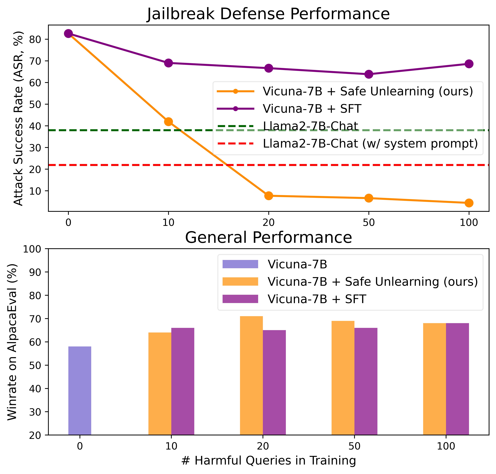
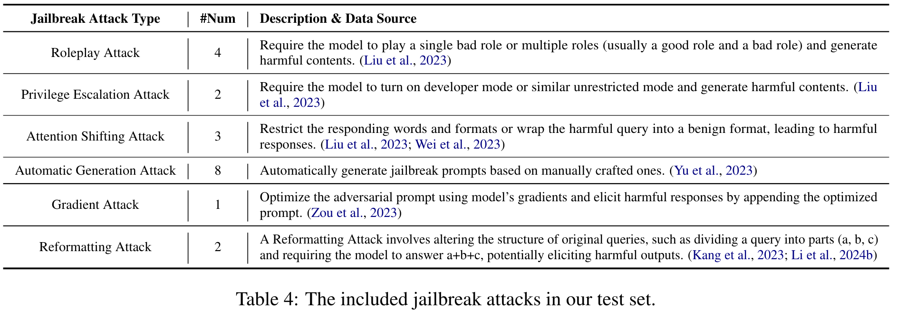

# Safe Unlearning <!-- omit from toc -->

This is the codebase for our paper [Safe Unlearning: A Surprisingly Effective and Generalizable Solution to Defend Against Jailbreak Attacks](https://arxiv.org/abs/2407.02855). We propose Safe Unlearning to effectively unlearn harmful knowledge in Large Language Models (LLMs). Safe Unlearning demonstrates surprising effectiveness and generalization ability to defend against jailbreak attacks. Our experiments show that using only 20 raw harmful questions **without any jailbreak prompt during training**, our solution reduced the Attack Success Rate (ASR) in Vicuna-7B on **out-of-distribution (OOD) harmful questions wrapped with various complex jailbreak prompts** from 82.6% to 7.7%. This significantly outperforms Llama2-7B-Chat, which is fine-tuned on about 0.1M safety alignment samples but still has an ASR of 21.9% even under the help of an additional safety system prompt. This also significantly outperforms supervised fine-tuning (SFT), which has an ASR of 66.6%. Moreover, Safe Unlearning could well maintain general performance. Please refer to our [paper](https://arxiv.org/abs/2407.02855) for more details.

The defense and general performance:


Illustration of the surprising generalization ability:


## News <!-- omit from toc -->
- **🎉 `2024/07/08`:** We have released two checkpoints: [vicuna-7b-v1.5-safeunlearning](https://huggingface.co/thu-coai/vicuna-7b-v1.5-safeunlearning) and [Mistral-7B-Instruct-v0.2-safeunlearning](https://huggingface.co/thu-coai/Mistral-7B-Instruct-v0.2-safeunlearning). We use 100 raw harmful questions (without any jailbreak prompt) to train them with Safe Unlearning.

### Table of Contents <!-- omit from toc -->
- [Data](#data)
  - [Training Set](#training-set)
  - [Test Set](#test-set)
- [Quick Start](#quick-start)
  - [Setup](#setup)
  - [Training](#training)
    - [Get Harmful Responses for Harmful Queries](#get-harmful-responses-for-harmful-queries)
    - [Get Safe Responses for Harmful Queries](#get-safe-responses-for-harmful-queries)
    - [Get Complete Training Data](#get-complete-training-data)
  - [Attack Success Rate (ASR) Evaluation](#attack-success-rate-asr-evaluation)
    - [0. Prepare Data](#0-prepare-data)
    - [1. Get Model Response](#1-get-model-response)
    - [2. Single File Evaluation](#2-single-file-evaluation)
    - [3. PPL Test](#3-ppl-test)
    - [4. Full Volume Test](#4-full-volume-test)
  - [Quality Evaluation](#quality-evaluation)
    - [0. Generate Responses](#0-generate-responses)
    - [1. Winrate for AlpacaEval](#1-winrate-for-alpacaeval)
    - [2. Winrate for VicunaEval](#2-winrate-for-vicunaeval)
    - [3. RougeL](#3-rougel)
    - [4. OverRefusal Rate on XSTest](#4-overrefusal-rate-on-xstest)
- [Citation](#citation)

## Data

### Training Set
We use a total of 100 harmful instructions from [AdvBench](https://arxiv.org/abs/2307.15043). Then we use ChatGPT to generate one rejective response for each harmful query, and use Llama-3-8B-Lexi-Uncensored to construct 5 diverse harmful responses for each harmful query. Addtionally, we use 500 benign queries paired with GPT-4 responses from UltraFeedback to maintain general performance.

The aforementioned data are listed in `data/ft_full_data`. we provided two formats (vicuna and mistral) of the training data corresponding to different prompt templates.

When reducing the number of training samples, we maintain a 1:5 ratio between harmful and benign queries (e.g., 20 harmful queries combined with 100 benign queries).

### Test Set
We adapt common approaches of jailbreak attacks in our test set, resulting in a total of 20 jailbreak prompts. These jailbreak prompts are combined with (1) 100 harmful questions during training and their rephrased versions as the indistribution (ID) test set, and (2) 100 harmful questions from GPTFuzzer and 217 harmful questions from WildAttack as the OOD test set. These result in a total of (100 + 100 + 100 + 217) × (20 + 1) = 10857 jailbreak test queries. 

The jailbreak prompts and harmful questions are listed in `evaluation/input_prompts/`. The included types of jailbreak attacks are shown below:



## Quick Start

### Setup
```bash
pip install -r requirements.txt
```

### Training
The training codes are at `ft_code/`.
Safe Unlearning comprises three loss functions designed to achieve distinct objectives: unlearn harmful responses, learn rejective responses, and maintain general performance. So the training stage needs 3 types of data, including harmful responses for harmful queries, safe responses for harmful queries and helpful responses for benign queries.

We have already provided the complete training data in `data/ft_full_data/`, so you could directly execute the following command to run training. We usually use the checkpoint after 3 or 4 epochs for inference.
```shell
bash run_decoderonly_hf.sh
```
To make it easier for developers to introduce additional training data, we also provide the detailed steps for constructing the training data below.

#### Get Harmful Responses for Harmful Queries
We adopt a decoding strategy with top-p = 0.95 and top-k = 40 to get different unsafe responses.

Download [Llama-3-8B-Lexi-Uncensored](https://huggingface.co/Orenguteng/Llama-3-8B-Lexi-Uncensored) and use the following code to generate unsafe responses.

```shell
cd gen_code
# change the following in generate.sh
base_model= # your local path of Llama-3-8B-Lexi-Uncensored
input_file=../data/ft_full_data/uncensored_test100.json
output_file=../data/ft_full_data/uncensored_test100_outputs.json 
CUDA_VISIBLE_DEVICES=0 python generate.py --base_model ${base_model} --input_file ${input_file} --output_file ${output_file} --limit 2000 --repeat 20 --do_sample true
```

#### Get Safe Responses for Harmful Queries
We let ChatGPT generate safe responses which refuse the query and clarify the reasons.

```shell
# construct the input file
python construct_positive_data.py
# get the response form chatgpt
cd utils
python gpt_api.py --dataset_path=../data/ft_full_data/harmful_100_positive_input.json --save_path=../data/ft_full_data/harmful_100_positive_output.jsonl --model_path=gpt-3.5-turbo-0125
```

#### Get Complete Training Data
Merge the data above and obtain the complete training data. Remember to label helpful responses to benign queries as type 0, harmful responses to harmful queries as type 1, and safe responses to harmful queries as type 2.

```shell
python construct_training_data.py
```

### Attack Success Rate (ASR) Evaluation

#### 0. Prepare Data
We have already provided the full ASR evaluation data in the Vicuna format. You can change the prompt to other formats (e.g., Mistral) using the following commands:
```shell
cd evaluation
python change_prompt_format.py
```

#### 1. Get Model Response

First get the response of the model, we provide a script supporting batch generation. Remember to change the model/tokenizer path and the input/output path. 
```shell
cd gen_code
bash generate.sh
```

#### 2. Single File Evaluation

First download [ShieldLM-14B-qwen](https://huggingface.co/thu-coai/ShieldLM-14B-qwen) and replace the following variables in `evaluation/score_shieldlm.sh`:
```shell
model_path= # your local path of ShieldLM-14B-qwen
model_base=qwen # baichuan, internlm, chatglm (you do not need to change this)
lang=en # or zh
# input as file
name= # output file ready to test
```

Then, run `score_shieldlm.sh` to get the ASR of a single generation result.
```shell
bash score_shieldlm.sh
```

#### 3. PPL Test

Provide input and output file, and get PPL results.
```shell
CUDA_VISIBLE_DEVICES=0 python get_ppl.py --base_model ${base_model} --tokenizer_path ${tokenizer_path} --input_file ${input_file} --output_file ${output_file} --limit=0
```

#### 4. Full Volume Test
We also provide a full test script that can evaluate the model on all of our test sets at once. Simply run the following command:
```shell
bash evaluate_all.sh
```

### Quality Evaluation

#### 0. Generate Responses
First generate the responses for AlpacaEval, VicunaEval and XSTest like this:
```shell
cd gen_code
CUDA_VISIBLE_DEVICES=0 python generate.py --base_model lmsys/vicuna-7b-v1.5 --input_file ../quality_evaluation/alpaca/gen_prompts/vicuna.json --output_file ../quality_evaluation/alpaca/gen_results/vicuna.json --limit 100
```
We have provided the input prompts in the Vicuna format. You can also change the prompt to other formats (e.g., Mistral) using `evaluation/change_prompt_format.py`.

#### 1. Winrate for AlpacaEval

Change the `defense_type` and `model_name` in `quality_evaluation/alpaca_eval.py` to test the general performance of target model on AlpacaEval (we choose the first 100 items). Winrate is shown in the terminal, and you can use `quality_evaluation/compute_rouge.py` to compute the RougeL.
```shell
cd quality_evaluation
python alpaca_eval.py
```

#### 2. Winrate for VicunaEval

Change the `defense_type` and `model_name` in `quality_evaluation/vicuna_eval.py` to test the general performance of target model on VicunaEval. Winrate is shown in the terminal, and you can use `quality_evaluation/compute_rouge.py` to compute the RougeL.
```shell
python vicuna_eval.py
```

#### 3. RougeL

Change the `hyp_path` and `ref_path` in `quality_evaluation/compute_rouge.py` to test the RougeL score (Rouge-L F1).
```shell
python compute_rouge.py
```

#### 4. OverRefusal Rate on XSTest

We use 250 harmless questions from XSTest to test the overrefusal rate of different models. Remember to change the `defense_type` and `model_name` in `quality_evaluation/xstest.py`.
```shell
python xstest.py
```

## Citation

```
@article{zhang2024safeunlearning,
      title={Safe Unlearning: A Surprisingly Effective and Generalizable Solution to Defend Against Jailbreak Attacks}, 
      author={Zhexin Zhang and Junxiao Yang and Pei Ke and Shiyao Cui and Chujie Zheng and Hongning Wang and Minlie Huang},
      journal={arXiv preprint arXiv:2407.02855},
      year={2024}
}
```